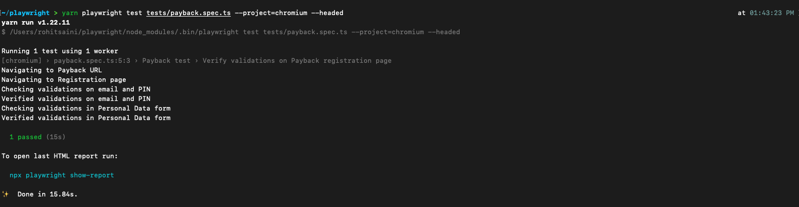

# playwright

#Install Playwright
    yarn create playwright
#OR you can Install using NPM
    npm init playwright@latest

# Test Name
    payback.spec.ts # Available in tests folder

//Test was flaky upon clicking on Anmelden/Register Button because no testId/UniqueId were present, So to fix that i have set retries to 3 in playwright.config.

##To run headless test on chrome
    yarn playwright test tests/payback.spec.ts --project=chromium

#To run With NPM
    npx playwright test tests/payback.spec.ts --project=chromium

##To Run without headless on chrome
    yarn playwright test tests/payback.spec.ts --project=chromium --headed

#To run With NPM
    npx playwright test tests/payback.spec.ts --project=chromium --headed
